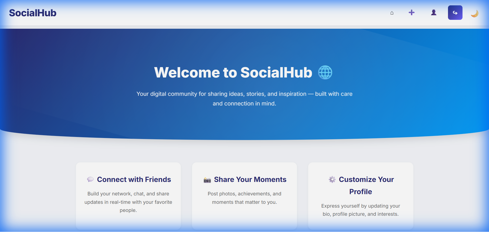
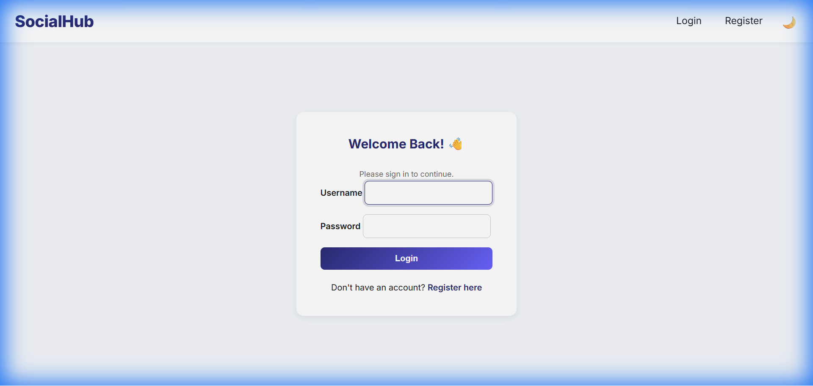
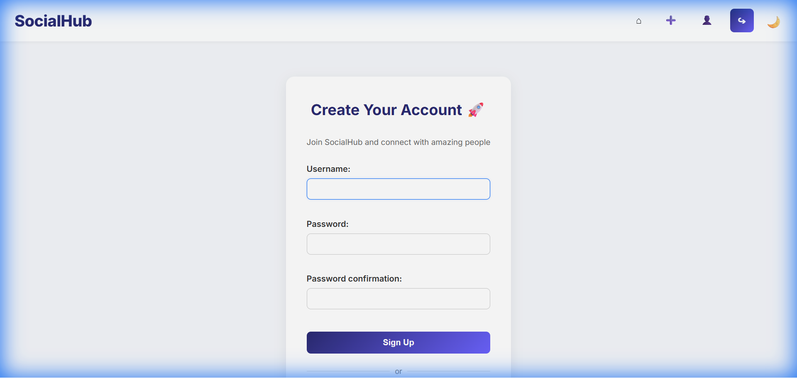
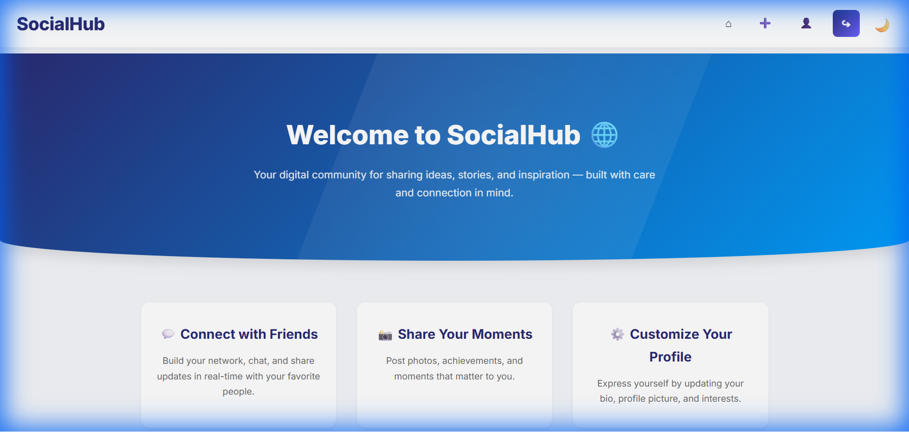

# SocialHub 🌐

SocialHub is a simple yet powerful social networking web app built with Django. It allows users to create accounts, share posts, follow others, and interact in a clean, modern interface. Designed with responsive layouts and a light/dark theme toggle, SocialHub delivers a smooth, app-like experience across all devices.

## ✨ Features

-   **User Authentication**: Secure Login and Registration system.
-   **Personalized Feed**: View posts from users you follow and your own updates.
-   **Create Posts**: Share your thoughts with the community.
-   **Interactions**: Like posts and comment on them to engage with others.
-   **Follow System**: Follow other users to see their content in your feed.
-   **Profile Pages**: View user profiles, bios, and their post history.
-   **Dark Mode**: Toggle between light and dark themes for comfortable viewing.
-   **Responsive Design**: Optimized for both desktop and mobile devices.

## 🛠️ Tech Stack

-   **Backend**: Django (Python)
-   **Frontend**: HTML5, CSS3 (Custom Glassmorphism Design)
-   **Database**: SQLite (Default Django DB)

## 🚀 Installation & Run

Follow these steps to set up the project locally:

1.  **Clone the Repository**
    ```bash
    git clone https://github.com/yourusername/CodeAlpha_SocialHub.git
    cd CodeAlpha_SocialHub/CodeAlpha_SocialHub-main
    ```

2.  **Create a Virtual Environment (Optional but Recommended)**
    ```bash
    python -m venv venv
    # Windows
    venv\Scripts\activate
    # macOS/Linux
    source venv/bin/activate
    ```

3.  **Install Dependencies**
    ```bash
    pip install django
    ```

4.  **Apply Migrations**
    ```bash
    cd social_project
    python manage.py migrate
    ```

5.  **Run the Server**
    ```bash
    python manage.py runserver
    ```

6.  **Access the App**
    Open your browser and go to: `http://127.0.0.1:8000/`

## 📸 Screenshots

### Home Feed


### Dark Mode


### Profile Page


### Login View


### Registration


### Create Post


### Comments


### Mobile View

